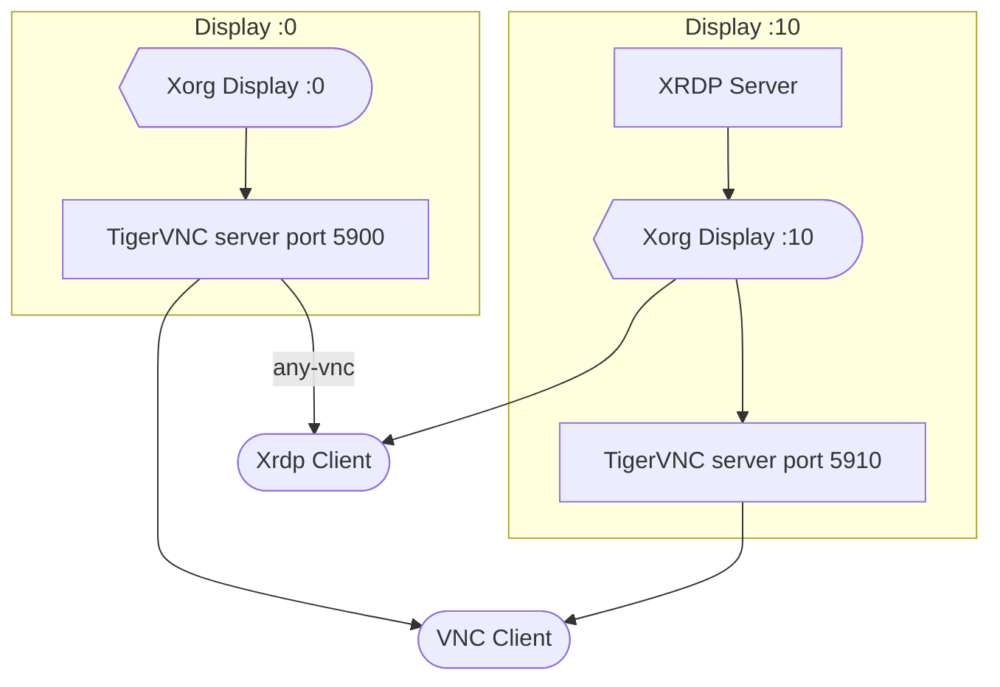

# Welcome to AstroArch! Astrophotography on ArchLinux for Raspberry Pi, PC and mini PC (works also on Manjaro and all Arch derived distros)

[![Discord chat][discord-badge]][discord-url] <= Join us on discord!

[discord-badge]: https://img.shields.io/discord/1100468635086106706?logo=discord&style=flat-square
[discord-url]: https://discord.gg/uJEQCZKBT8


Please find below some (hopefully) useful instructions, if you are here instead because you want to know how you can build this image from scratch, see [this](https://github.com/MattBlack85/astroarch/blob/main/BUILD.md)
 - [Quick video intro](#quick-video-intro-to-astroarch)
 - [What Raspberry is supported?](#what-raspberry-version-is-supported)
 - [Why ArchLinux?](#why-archlinux)
 - [Download](#download)
 - [Flash the image to SD](#flash-the-img-to-an-sd)
 - [On first boot - things to know](#first-boot)
 - [Performance and compositor](#performance-and-compositor)
 - [Connecting via noVNC (browser)](#connecting-via-browser-novnc)
 - [Connecting via VNC client (this is the preferred way)](#connecting-via-vnc-client)
 - [Connecting via XRDP client](#connecting-via-xrdp-client)
 - [Issues with VNC](#issues-with-vnc)
 - [How can I use a raspberry camera?](#how-can-i-use-a-raspberry-camera)
 - [How can I boot from USB/SDD?](#boot-from-external-disk-usb-hdd-ssd-nvme)
 - [Kstars hours is not correct, how can I fix it?](#set-timezone)
 - [What are the passwords for the user and the hotspot?](#passwords)
 - [Protect VNC with a password](#how-to-protect-vnc-with-password)
 - [Useful commands](#useful-commands)
 - [List of available software](#software-available)
 - [How can I add a RTC to AstroArch?](#how-to-add-a-rtc)
 - [How to make a GPS dongle working?](#using-a-gps-dongle)
 - [How to enable bluetooth?](#how-to-enable-bluetooth)
 - [How to enable an FTP server?](#how-to-enable-ftp)
 - [Where can I find more packages?](#where-to-find-more-pacakges)
 - [How can I install Python packages?](#how-to-install-python-packages)
 - [reporting problems](#reporting-issues)
 - [For PC/mini PC running an ArchLinux derived distro (Manjaro, ArcoLinux, etc.)](#use-only-the-astro-packages-mantained-for-astroarch-on-pc-and-mini-pc)
 - [Tips](#tips)

# What Raspberry version is supported?
AstroArch runs on any raspberry capable to run aarch64 OS, this means `Raspberry Pi 4` and of course `Raspberry Pi 5`

Note on the possible back-powering of the raspberry by a mount, camera, powered USB hub or other devices having its own power source and connected to the raspberry by USB. Plug in your raspberry then connect each device so as not to have issues for your AstroArch.

# Download
Please use this link to download the latest astroarch gzipped img file => 
https://drive.google.com/file/d/1CzN3f9_lNp2InT2PLvp_vflsW7gywFZB/view
# Why ArchLinux?
Why ArchLinux?

Because control matters.
Because when you're under the stars, 200 km from the nearest Wi‑Fi, you don't want to wrestle with package managers or beg an outdated distro for a newer kernel.

ArchLinux gives us clarity.
No cruft. No bloated defaults. No assumptions.
Just a fast, minimal, bleeding-edge base that stays out of your way and respects your intent.
Exactly what an astrophotography system should do.

Some ask, why not Raspbian?
Because I’ve used it. Because I’ve waited weeks for upstream fixes to trickle through layers of bureaucracy. Because when something breaks in the field at 2 AM, I’d rather pacman -Sy than dig through obsolete forum posts.
Because I’ve seen what happens when distros try to protect you by locking the door and hiding the keys.

This isn’t about gatekeeping.
This is about choosing the right tool for the job—even if it demands more from the user.
If you're the kind of person who compiles INDI from source just to try a bleeding-edge driver,
then you already get it.
Arch isn't a barrier. It's a launchpad.

AstroArch was built for those who tinker. For those who read logs instead of rebooting. For those who know that freedom and responsibility walk hand in hand.

You don't have to like Arch.
But I do. And that’s why we're here.

    AstroArch was built for curiosity, not consensus.
    Even if I’m the only one who finds joy in it—tuning drivers, reshaping workflows, and bending the system to my will—that’s enough.
    But if that sounds like your kind of fun, welcome aboard.

# Flash the img to an SD
If you prefer a GUI, use [balenaHetcher](https://www.balena.io/etcher/) otherwise you can use the unix `dd` to flash it, and if you are using `dd` I think
there is nothing I shall explain to you :)

# First boot
After you burned the .img file to your SD, you _should_ be able to reach astroarch via VNC, however if you don't see the desktop or you can't connect to it
this likely means that unfortunately your raspberry pi rev cannot boot the image. In this case please plug a monitor and report here the output!
Once you are logged in the first thing you should do is update the system, open the terminal and type `update-astroarch` command

# Set timezone
Here a small video that will show you how to set the timezone without the terminal

https://github.com/devDucks/astroarch/assets/4163222/a935b491-5b7a-444d-9f89-a01a279063de

If you want to use the terminal list first the available timezone with `timedatecl list-timezones` and then set the right one with `sudo timedatectl set-timezone Foo/Bar` where Foo/Bar is something like `Europe/Rome`

Do not forget to set the right timezone!

# Passwords
To save you some time, here the default password you will need for AstroArch:
 - the user password for `astronaut` (which is the user used to login or for ssh) is `astro`
 - the password for the `AstroArch-XXXXXXX` WiFi hotspot is `astronomy`

# Performance and compositor
IMPORTANT!
Be aware that from version 2.0 the compositor is enabled by default, while this will enhance by a lot graphics (making everything smoother) it will probably increase
system resource utilisation. If you want to disable it, just add the following line `Enabled=false` in the file `/home/astronaut/.config/kwinrc`

# How to protect VNC with password
If you want to add more security to your installation (or maybe you are at a starparty with more users running AstroArch), you may want to add a password to VNC (by default there is no password).
To do so first set a password running `sudo vncpasswd` and after that edit `/etc/systemd/system/x0vncserver.service` changing the ExecStart line from this


```
ExecStart=x0vncserver -display :0 -SecurityTypes None
```


to this


```
ExecStart=x0vncserver -display:0 -rfbauth /root/.vnc/passwd
```

Reboot and now you should be prompted to input a password when connecting via VNC

# How can I use a raspberry camera
AstroArch finally supports raspberry cameras via indi pylibcamera, to install it and having fun with it just run `sudo pacman -S indi-pylibcamera`

# Use only the astro packages maintained for AstroArch on PC and mini PC
If you have an x64 distro based on ArchLinux on your PC and you just want to access the packages I maintain (kstas, phd2, stellarsolver, indi, indi libs and drivers) add my repo to your pacman.conf file (under /etc/pacman.conf) **before** the [core] section, the repo looks like the following
```
[astromatto]
SigLevel = Optional TrustAll
Server = http://astroarch.astromatto.com:9000/$arch
```

after that run `sudo pacman -Sy && sudo pacman -S kstars phd2 indi-3rdparty-drivers stellarsolver`

# Useful commands
The following are some useful commands that you can run from the terminal so you don't have to deal with complicated stuff by yourself if you don't want to:
 - `update-astroarch` => this command will update system packages (including kstars, indi, etc. if there are new versions) and will pull any fix for astroarch itself, additionally will update the astroarch configuration that may bring in more commands etc.
 - `astro-rollback-indi` => rollback automatically indi to the previous version
 - `astro-rollback-kstars` => rollback automatically indi to the previous version
 - `astro-rollback-full` => rollback automatically indi and kstars to the previous version
 - `use-astro-bleeding-edge` => install bleeding edge packages for Kstars and INDI
 - `use-astro-stable` => install stable  packages for Kstars and INDI
 - `kstars-watchdog` => starts Kstars and Ekos with the default profile. If the program is closed or crashes, il will restart automatically. If an ekos job file named default.esl is present in the home dir, it will automatically be started.

# Connecting via browser (noVNC)
By default `AstroArch` will start a hostpot called `AstroArch`, to connect to that WiFi network use the password `astronomy`

noVNC is installed and it will start by default, if your pi is wired to your network you can connect to it with the following methods:
- **http://astroarch.local:8080/vnc.html**
- if the previous method doesn't work, find your raspberry pi IP, connect to it through your browser typing `http://RASPBERRY_IP:8080/vnc.html`

otherwise, if you want to connect to its hotspot, find the WiFi network `AstroArch` (the pass is `astronomy`) and type in your browser `http://10.42.0.1:8080/vnc.html`

Welcome to astro arch!

# Connecting via VNC client
If you trust me, this should be always the preferred way to connect using VNC. noVNC goes through the browser and is less fluid and performant than a real VNC client.
You can use whatever VNC client you prefer, there should be no issue.

The address is `astroarch.local` (or the IP if you prefer) and the port is 5900.

If you have started an Xorg session with Xrdp, you can connect with your VNC client on port 5910.

Few VNC client suggestions (work an all platforms):
- TigerVNC (https://tigervnc.org/)
- RealVNC (https://www.realvnc.com/en/)

# Connecting via XRDP client
Another option to control your Raspberry Pi remotely is to use an XRDP client. For this you can use the "remote desktop connection" tool if you are on Windows or on Linux or a software like FreeRDP.
You can also, after installing the xfreerdp package corresponding to your distribution, use the command line: xfreerdp /dynamic-resolution /u:astronaut /w:1920 /h:1080 /v:X.X.X.X (Where X.X.X.X is the IP address of the pi)

Xrdp is smoother and faster than vnc but be aware that it also consumes at least 500M of memory. This can be limiting for use on a Raspberry with only 4G.

XRDP and VNC have different purposes. VNC only allows you to replicate the user's existing session. XRDP can also do this by selecting the vnc-any session. However, the main use of XRDP is not to replicate but to open a new Xorg session for the user on the Display 10.0 environment variable.

To connect with a new Xorg session (recommended):


To connect with a VNC session:





# Issues with VNC

Beware of metal cases and USB3 hubs, which can interfere with the RPI's Wi-Fi driver. Try connecting an external Wi-Fi antenna to your Raspberry.

Before continuing, check the status of your brcmfmac driver. Use the command `journalctl -b --since today | grep brcmfmac or dmesg | grep brcmfmac`.
If you get a brcmfmac error: brcmf_set_channel: set chanspec 0x100c fail, reason -52, you must run these commands:

```
sudo systemctl stop wpa_supplicant
sudo systemctl stop NetworkManager
sudo systemctl stop x0vncserver
sudo killall wpa_supplicant
sudo rfkill unblock all
sudo modprobe -r brcmfmac_wcc
sudo modprobe -r brcmfmac
sudo modprobe brcmfmac
sudo systemctl start wpa_supplicant
sudo systemctl start NetworkManager
sudo systemctl start x0vncserver
sudo /home/astronaut/.astroarch/scripts/create_ap.sh
reboot
```

After restarting, check that you no longer have any errors with the brcmfmac driver.

Other controls:

- Check that the RPI and your PC/tablet are using WPA2.
  
- Check your PC's Wi-Fi settings to ensure that IPV6 is not enabled. Normally, IPV6 is disabled for the access point on AstroArch.
  

Check that Wi-Fi power management is disabled on the client PC you are connecting to the Raspberry Pi using the iwconfig command. If it is not disabled, you must disable it permanently.

**Linux Mint / Ubuntu / Debian**

`sudo nano /etc/NetworkManager/conf.d/default-wifi-powersave-on.conf`

```
[connection]
wifi.powersave = 2
```

**ArchLinux**

/etc/udev/rules.d/81-wifi-powersave.rules

```
ACTION==“add”, SUBSYSTEM==‘net’, KERNEL==“wl*”, RUN+=“/usr/bin/iw dev wlan0 set power_save off”
```
Change wlan0 to the name of your wifi that you will find with the ifconfig command.

Other considerations:

- Try changing the Wi-Fi frequency of your RPI and your PC from “automatic” to “2.4 GHz.” Change the channel if necessary.
  
- Try changing your regdomain. To configure the regdomain, install wireless-regdb and reboot, then edit the /etc/conf.d/wireless-regdom file and uncomment the appropriate domain by removing the # sign in front of your country code (e.g., US), or add cfg80211.ieee80211_regdom=" your country code" to cmdline.txt.
  
- If you are using RealVNC Viewer, set the image quality to high in the options. Other values ​​cause CPU issues.

# Adding swap
By default astroarch don't have swap, for prevent issues about memory space you can add a swap file and enable it, we will set swappiness to 10 don't use swap file if RAM space is ok.
In this example we make a 2GB swapfile 
```
sudo fallocate -l 2G /swapfile
sudo chmod 600 /swapfile 
sudo mkswap /swapfile
sudo swapon /swapfile
sudo echo "vm.swappiness = 10" | sudo tee -a  /etc/sysctl.d/99-swappiness.conf
```

Check swappiness
```
$ cat /proc/sys/vm/swappiness
10
```
Check if Swap is enabled
```
free -h
```
Output should be something like this on Swap row :
```
$ free -h
               total        used        free      shared  buff/cache   available
Mem:           3.7Gi       1.4Gi       1.1Gi        88Mi       1.3Gi       2.3Gi
Swap:          2.0Gi          0B       2.0Gi
```
Make permanent swapfile on system
```
$ sudo echo "/swapfile   none    swap    sw              0       0" | sudo tee -a  /etc/fstab
```

# Boot from external disk (USB, HDD, SSD, NVME)
If you want to use an alternative media to boot AstroArch, just flash the image to your support and it will work out of the box for USB and SSDs! No special steps are required

If you have a NVMe there are some additional steps to be able to boot from it:
- install rpi-eeprom with `sudo pacman -S rpi5-eeprom` (or rpi4-eeprom if you have a rasberry4)
- be sure to run the latest eeprom firmware `sudo rpi-eeprom-update -a`
- *be sure to read this table https://www.raspberrypi.com/documentation/computers/raspberry-pi.html#boot_order-fields*
- decide the boot order for your raspberry, bear in mind that the priority goes right to left, so for example, if you want your boot
  to be something like NVMe first, then USB then SD card the values to put in the `BOOT_ORDER` field would be 641 but since it's reversed we should put 146
  with a final value (put always the f) of `0xf146`
- create a new file with the following command 
```sh
cat>eeprom.conf<<EOF
[all]
BOOT_UART=1
WAKE_ON_GPIO=0
POWER_OFF_ON_HALT=1
BOOT_ORDER=0xf146
PCIE_PROBE=1
EOF
```
- apply the eeprom settings `sudo rpi-eeprom-config --apply eeprom.conf`
- remove the eeprom settings created in the previous steps `rm eeprom.conf`
- the eeprom update requires a reboot, so be sure to reboot your pi

>[!IMPORTANT]
>For non-PD power supplies, or those not recognized as such, the Raspberry Pi considers them to provide 3 A. It then limits the current to 0.6 A and USB boot is disabled by default. See:
>https://www.raspberrypi.com/documentation/computers/raspberry-pi.html#differences-on-raspberry-pi-5
>
>You must add the parameter `usb_max_current_enable=1` to the config.txt file if you are not using the official power supply or a PD-certified power supply. During initial setup with AstroArch-onboarding, in the Power supplies panel, select <mark>Power supply without USBC-C PD</mark>

# Software available
the following software will be available, by category

### Astronomical
- Kstars 3.7.9
- phd2 2.6.13dev2
- indi libs 2.1.6 **(all of them)**
- indi drivers 2.1.6 **(all of them)**
- most of the widefield indexes for plate solving
- astromonitor (you never heard of it? Check it here https://github.com/MattBlack85/astro_monitor)
- AstroDMx (a capture software like FireCapture)

### OS
- Konsole (terminal)
- KDE Plasma (Desktop environment)
- pacman (package manager, this is **NOT** debian based and pacman instead of apt is your package manager
- NetworkManager (to manage networks)
- Discovery (to install other packages)

### Connectivity
- tigervnc (x0vncserver)
- noVNC

### Browser
- chromium (like chrome, but without google tracking code)
- firefox

# How to add a RTC
Adding a RTC to AstroArch is easy from version 1.6.
First, wire your RTC to your pi, open a terminal and type `sudo i2cdetect -y 1` you should see a similar table, take note of the number for the next steps


Now find the line `dtoverlay=i2c-rtc` in `/boot/config.txt` and modify it by adding a comma and the name of your RTC device, in my case for the ds3231 will be `dtoverlay=i2c-rtc,ds3231`

Reboot your Raspberry PI and if you type again `sudo i2cdetect -y 1` you should now see a `UU` instead of the number, this means the kernel module for your RTC has been loaded correctly.

That's all you need! We just enabled automatic modules to setup the system time from the RTC if it's present! No more steps are required!

Reboot your PI and you should have the time automatically synchronized when it starts!

If you want to remove the RTC sync just drop `,xxxx` from `/boot/config.txt` at line `dtoverlay=i2c-rtc,xxxx`

# Using a GPS dongle
To use a GPS dongle, simply plug in your device and activate the GPSD service which is disabled by default. So the only command required is `sudo systemctl enable gpsd --now` and the service will start automatically after each boot. You can also manually edit `/etc/gpsd` and hardcode the device path on the `DEVICES=""` line with `DEVICES="/dev/gps0"`

Otherwise, simply use the following command `gps_on` to perform these two operations.

If you want to disable automatic startup of the GPS daemon, run `gps_off`.

ADDITIONAL CONSIDERATIONS (use these as guidelines):

If you are having trouble getting the signal, you may need to protect your USB3 cables (they interfere with the GPS signal)
if the device is not recognized (which is very unlikely on ArchLinux), we do not recommend using ttyXXX as it may point to other serial devices after a reboot

# How to enable bluetooth
By default there are no packages to enabling bluetooth, to install them and enabling bluetooth functionalities run the following command `bluetooth_on`, this command will install the BT packages and enable the bluetooth daemon to run automatically at boot.
If you want to disable bluetooth daemon autostart just run `bluetooth_off` and if you want to remove it run `bluetooth_remove`

# How to enable FTP
Identical to Bluetooth, there is no default package to activate an FTP server.

To install and activate it, run the following command `ftp_on`. This command will install the Very Secure FTP Daemon package and allow the FTP server to run automatically on startup.

To connect from a remote station, use an FTP client such as FileZilla or other. All you need to do is identify yourself with the astronaut user, his password and the IP address where the server is located. You will easily find the IP address of your LAN or WLAN with the ifconfig command in a console. Once connected, you can very quickly transfer your files in both directions.

If you want to disable the automatic start of the FTP server, simply run `ftp_off` and if you want to remove it, run `ftp_remove`.

# Where to find more packages?
If you want to install more packages you should look what is available here https://archlinuxarm.org/packages - if you find the package there you can easily install it running `sudo pacman -S PACKAGE_NAME`,
if you want to install packages using a GUI instead, open discovery (the blue bag icon on the tray) and follow the instructions.

If the package you are looking for is not there you may additionally have a look at the AUR https://aur.archlinux.org/ - AUR is a list of packages maintained by the community,
they are not ready to be installed so they can't be installed with pacman but instead you need `paru` (already installed on AstroArch), if you find your package on the AUR run `paru -S PACKAGE_NAME`
it will ask you for a review (confirm it) and then it will compile the package for you and install it. Please be patient, some packages are just huges and it may take some time to compile on lower hardware like the raspberry.
Even for AUR there is a graphical installer (although I never used it and I cannot guarantee if it works well or not), run `sudo pacman -S pamac-full` and you can run `pamac` to install graphically packages from the AUR.

What if your package is not in the AUR or the official ArchLinux repository? Please let me know, it is not hard to package stuff for ArchLinux and in fact I already do it for few things, I can take a look at the source and if possible I will try to package
it for Arch so that you may be able to install it using pacman.

# How to install Python packages?
PLEASE READ THIS CAREFULLY

Python packages via pip installing has changed over time and it now looks way more different than it was years ago, this may looks like a cultural shock if you are coming from more stable distros (Debian and similar) that still didn't catch up with this change but bear with us;
installing packages via pip globally is not supported anymore by default (`sudo pip install`) cause it messes up distro packaging. If you try to do so you will see an error message suggesting to use a virtual environment (which, by the way, is a GREAT suggestion).
Sometimes vietual envs are not simply possible, so there are 3 ways to achieve the wanted result:
1) install the package via the package manager (pacman) - if the python package you want to install is a common one, there is a big chance it's been packaged for ArchLinux already and you can install it with pacman - BEST WAY
2) open an issue here on github and let me know what python packages you would like to see available to be installed via `pacman`, it will take few days to few weeks depending on availability but it is doable - RECOMMENDED WAY if 1 is not possible
3) bypass the pip check and force a global install running `sudo pip install --break-system-packages PACKAGE_NAME` - NOT RECOMMENDED and likely to break other dependencies in the long run, if you do so, we do not offer any support, sorry!

# Reporting issues
AstroArch is actually in a stable state, however, should you find any issue please report them here https://github.com/MattBlack85/astroarch/issues this will help me tracking them and ship a fix for them

# Tips

- If you restart AstroArch-onboarding, it will not retain your configuration except for the locale settings (language, location, and keyboard). You must  make your choices again, otherwise it will use the default configuration
- If you are not comfortable with command lines for the “Useful commands” section, use <mark>AstroArch Tweak Tool</mark>
- If you need help from someone else, simply install the <mark>RustDesk</mark> software. This will allow the other person who has the same software with the ID and one-time password you provide to connect to your Raspberry Pi (easy and secure)
- The <mark>xgps</mark> software in the Applications panel under “Utilities” allows you to view information from your GPS device

# Quick video intro to AstroArch

https://github.com/devDucks/astroarch/assets/4163222/27bb0842-2db0-4db7-83e5-c513c8e02f5a


